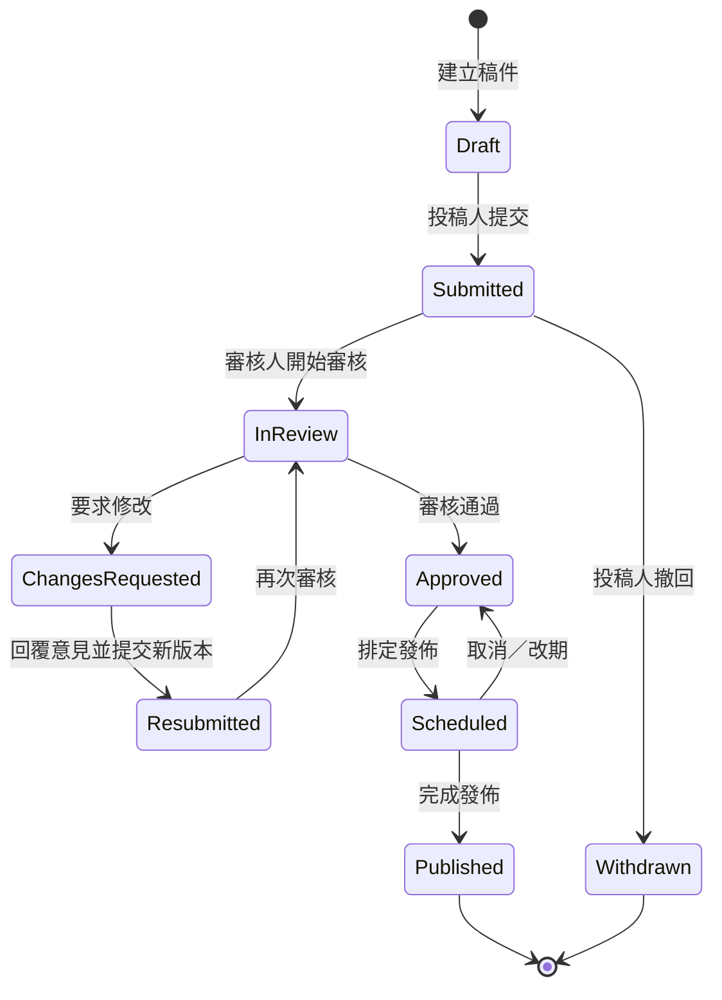
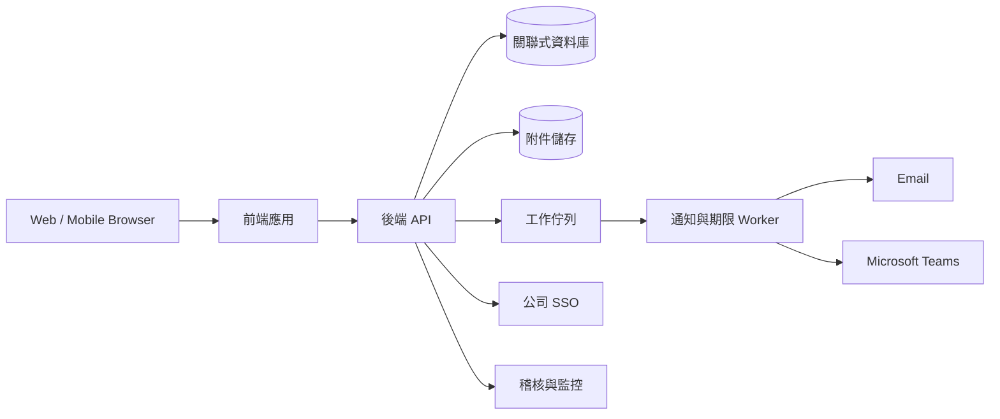

# Culture Tells 稿件審核與發佈管理系統方案

## 1. 目標與設計原則

### 現況痛點

- 稿件透過 Email、聊天或共享文件往返，最新版與負責人不清楚。
- 審核意見散落在不同管道，修改時容易漏掉。
- 沒有明確的期限、提醒與逾期升級機制，可能錯失發表檔期。
- 難以回溯「誰在何時提出意見、作者如何處理、誰核准發佈」。

### 系統目標

建立一個單一入口，讓投稿人提交稿件、審核人逐條批註、投稿人回覆並重新提交；系統同時管理版本、期限、通知及完整稽核軌跡，讓每一篇稿件的下一步與責任人都清楚可見。

### 設計原則

1. **單一事實來源**：稿件、附件、意見、狀態與期限都留在同一案件中。
2. **意見必須閉環**：每一則需處理的意見都要有「待處理／已回覆／已解決」狀態。
3. **狀態驅動責任**：任何時刻都能看到目前由誰處理，以及下一個截止時間。
4. **版本不可覆寫**：每次重新提交產生新版本，舊版本可比較、可回溯。
5. **通知可行動**：通知應包含案件、待辦、期限和一鍵進入處理頁面的連結。

## 2. 使用者角色與權限

| 角色 | 主要能力 |
| --- | --- |
| 投稿人（Author） | 建立草稿、上傳附件、提交、回覆批註、上傳新版本、撤回尚未開始審核的稿件 |
| 審核人（Reviewer／HR） | 接受或轉派案件、行內批註、建立整體意見、要求修改、核准或退回 |
| 發佈編輯（Publisher） | 安排發佈日期、執行發佈、記錄發佈網址、取消或改期 |
| 系統管理員（Admin） | 管理人員與群組、工作流程、通知規則、範本、假日曆與報表 |
| 觀察者（Viewer，可選） | 僅查看指定案件及進度，不可修改 |

權限採 **角色權限 + 案件成員** 雙層控制；未被指派的人即使具有 Reviewer 角色，也不一定能看到機密稿件。人員異動時，以群組（例如 `HR Reviewers`）承接權限，避免流程中斷。

## 3. 建議工作流程



### 狀態與責任人

| 狀態 | 當前責任人 | 可執行動作 | 預設期限建議 |
| --- | --- | --- | --- |
| 草稿 Draft | 投稿人 | 編輯、提交 | 無，或投稿檔期前 10 個工作天 |
| 待接件 Submitted | HR 審核群組 | 接件、指派、退回補件 | 1 個工作天 |
| 審核中 In Review | 指定審核人 | 批註、要求修改、核准 | 3 個工作天 |
| 待修改 Changes Requested | 投稿人 | 回覆意見、提交新版 | 3 個工作天 |
| 已重送 Resubmitted | 原審核人 | 再審、要求修改、核准 | 2 個工作天 |
| 已核准 Approved | 發佈編輯 | 排程 | 2 個工作天 |
| 已排程 Scheduled | 發佈編輯 | 發佈、改期 | 發佈日前完成 |
| 已發佈 Published | 無 | 查看、封存 | 無 |

期限應支援組織假日曆與工作天計算。管理員可依稿件類型或優先級設定不同 SLA，案件負責人可在留下原因後調整個別期限。

## 4. 核心功能

### 4.1 投稿與版本管理

- 投稿表單包含：標題、摘要、作者／部門、稿件類型、語言、預計發佈日、目標受眾、正文、附件與相關連結。
- 必填欄位、字數、附件格式與個資聲明在提交前自動檢查。
- 每次提交或重新提交都建立唯讀版本（V1、V2……），並記錄提交者與時間。
- 支援文字差異比較；Word、PDF 等附件至少保留版本清單，後續可再加入檔案內容比較。
- 投稿人修改時使用工作副本，不直接改動已送審的版本。

### 4.2 批註與意見閉環

- 審核人可對一段文字做行內批註，也可留下整篇稿件的總體意見。
- 意見分為「必須修改」「建議」「問題」；只有「必須修改」會阻擋核准。
- 每則討論串包含留言、提及人員、附件、建立時間與最後更新時間。
- 投稿人對每則意見選擇：`已修改`、`說明／保留原文`，並附回覆；審核人最後標記 `已解決` 或重新開啟。
- 重新提交前，系統顯示仍未回覆的必要意見並阻止漏項；若審核人要核准仍有未解決的必要意見，也需明確確認並留下原因。

### 4.3 任務、期限與通知

每次狀態轉換自動建立一項待辦，待辦包含負責人、開始時間、截止時間、優先級及來源案件。

建議預設通知規則：

| 事件 | 收件人 | 管道 |
| --- | --- | --- |
| 投稿成功／重新提交 | 投稿人、審核人 | 站內 + Email／Teams |
| 被指派、被提及、新批註 | 當事人 | 站內 + Email／Teams |
| 截止前 24 小時 | 當前負責人 | 站內 + Email／Teams |
| 到期當日 | 當前負責人 | 站內 + Email／Teams |
| 逾期 1 個工作天 | 當前負責人及備援人 | Email／Teams |
| 逾期 2 個工作天 | HR 主管／流程管理員 | Email／Teams（升級） |
| 核准、排程、發佈或改期 | 投稿人及相關成員 | 站內 + Email／Teams |

為避免通知疲勞，非緊急更新可以每日摘要寄送；提醒需具備冪等性，確保同一規則不會因排程重跑而重複發送。使用者可以設定偏好，但不能關閉逾期升級和關鍵狀態通知。

### 4.4 工作台與搜尋

- **我的待辦**：依即將到期、已逾期、優先級排序。
- **我提交的稿件**：顯示目前狀態、責任人、下一期限與未解決意見數。
- **審核佇列**：HR 主管可查看未指派、負載與 SLA 風險，並批次指派。
- **發佈行事曆**：以週／月檢視已核准與已排程稿件，發現檔期衝突。
- 可依標題、作者、部門、狀態、標籤、日期、審核人及發佈檔期篩選。

### 4.5 稽核與報表

- 狀態異動、版本提交、期限調整、指派、批註狀態及核准決策均寫入不可由一般使用者修改的活動紀錄。
- 報表包含：各狀態案件數、平均審核時間、平均修改輪次、準時率、逾期案件、審核人負載及按期發佈率。
- 可匯出 CSV；正文與附件依公司資料保留政策封存或刪除，稽核紀錄另依合規期限保存。

## 5. 頁面資訊架構

1. **首頁／工作台**：我的待辦、即將到期、逾期、最近更新。
2. **稿件列表**：篩選、排序、儲存檢視、匯出。
3. **新建／編輯稿件**：表單、正文編輯器、附件、儲存草稿、提交前檢查。
4. **稿件詳情**：
   - 頂部：狀態、當前責任人、截止時間、主要動作。
   - 中間：正文與行內批註，或版本差異比較。
   - 右側：意見清單，可依未回覆／未解決篩選。
   - 底部／分頁：附件、版本、活動紀錄與發佈資訊。
5. **審核佇列與行事曆**：供 HR 與發佈編輯使用。
6. **管理設定**：人員群組、工作流程、SLA、通知、假日曆、範本。

## 6. 資料模型（概念）

| 實體 | 重要欄位 |
| --- | --- |
| `User` | id、姓名、Email、部門、狀態 |
| `Group` / `Membership` | 群組及成員關係 |
| `Submission` | id、標題、作者、狀態、當前責任人、優先級、目標發佈日、目前版本 |
| `SubmissionVersion` | 版本號、正文快照、附件清單、提交者、提交時間 |
| `CommentThread` | 所屬版本、文字錨點、類型、狀態、建立者、解決者 |
| `Comment` | 討論串、作者、內容、附件、建立時間 |
| `Task` | 案件、任務類型、負責人、截止時間、完成時間、SLA 規則 |
| `Publication` | 排程時間、管道、發佈者、實際發佈時間、公開網址 |
| `Notification` | 事件、收件人、管道、發送狀態、冪等鍵 |
| `AuditEvent` | 操作者、動作、對象、異動前後摘要、時間、來源 IP／裝置資訊 |

文字批註的錨點不可只存游標位置；應同時保存選取文字、前後文與位置資訊，以便新版本中重新定位。無法可靠定位時標示為「原版本批註」，避免把意見錯掛到其他段落。

## 7. 系統架構建議



- 優先串接公司 SSO（SAML／OIDC）及既有人員群組，停用離職帳號。
- API 以伺服器端狀態機驗證合法轉換，不能只靠前端隱藏按鈕。
- 關聯式資料庫適合交易、版本關係與報表；附件放物件儲存並啟用惡意檔案掃描。
- 通知、期限掃描與報表交給背景工作佇列處理，並提供失敗重試與死信告警。
- 對外連結預設不公開；如需外部投稿，另設一次性安全連結、到期時間及更嚴格的附件限制。

### 自建或低程式碼選擇

若公司已全面使用 Microsoft 365，可先用 **Power Apps + SharePoint／Dataverse + Power Automate + Teams** 驗證流程，較快上線；但複雜的行內批註、版本差異及大量案件報表可能需要自建應用。建議先用 1～2 週做技術驗證，特別測試批註錨點、權限、版本不可變與通知冪等性，再決定長期平台。

### SharePoint 內建置的具體方案

**可以建置在 SharePoint Online 架構內**，而且若公司已有 Microsoft 365 授權，這會是 MVP 最務實的選擇。建議不要只用單一文件庫和 Email 做審核，而是以 SharePoint 作為資料與入口，搭配 Power Apps 實作操作介面、Power Automate 控制流程，並用 Teams／Outlook 發送可行動通知。

#### 元件對應

| 系統需求 | Microsoft 365 元件 | 實作方式 |
| --- | --- | --- |
| 系統入口與工作台 | SharePoint Communication Site | 提供「我的投稿」「待我審核」「即將到期」「發佈行事曆」頁面，嵌入 Power Apps 或清單 Web Part |
| 稿件與附件 | SharePoint Document Library | 每篇稿件建立一個文件集或資料夾，以欄位保存案件編號、狀態、作者、責任人、期限及預計發佈日，並開啟版本歷程 |
| 投稿／審核介面 | Power Apps | 自訂表單與工作台，依角色顯示提交、要求修改、重送、核准及排程動作 |
| 批註與回覆 | SharePoint Lists + Power Apps | 以結構化 `ReviewComments` 清單保存意見類型、所屬版本、原文摘錄、回覆與解決狀態，不依賴 Email 討論串 |
| 待辦與 SLA | SharePoint `ReviewTasks` List | 每次狀態轉換建立待辦，記錄負責人、期限、完成時間及升級層級 |
| 流程與通知 | Power Automate | 負責狀態轉換、建立版本／待辦、Approvals、提醒、逾期升級、Teams 與 Outlook 通知 |
| 使用者與權限 | Microsoft Entra ID + SharePoint Groups | 使用既有公司帳號、HR 群組及發佈群組；機密案件另使用項目／資料夾權限 |
| 報表 | SharePoint Views；需要時使用 Power BI | MVP 先做逾期、狀態、責任人檢視，後續再做週期時間及準時率儀表板 |
| 稽核 | `WorkflowHistory` List + Microsoft 365 Audit | 業務事件另寫入只能由流程新增的歷程清單；平台層操作由 Microsoft 365 稽核承接 |

#### 建議的 SharePoint 資訊架構

```text
Culture Tells Site
├── Site Pages
│   ├── Home / 我的工作台
│   ├── Submit / 新增投稿
│   ├── Review Queue / HR 審核佇列
│   └── Publication Calendar / 發佈行事曆
├── Libraries
│   └── CultureTellsSubmissions / 稿件與附件版本
└── Lists
    ├── Submissions / 案件主檔與流程狀態
    ├── ReviewComments / 結構化批註與回覆
    ├── ReviewTasks / 負責人、期限與完成狀態
    ├── Publications / 發佈排程與網址
    ├── WorkflowHistory / 業務稽核歷程
    └── WorkflowConfig / SLA、通知與升級規則
```

`Submissions` 是案件的主索引，`SubmissionId` 是所有文件與清單的共同鍵。正文若以 Word 撰寫，文件放在文件庫並使用 SharePoint／Word 版本歷程；若正文直接由表單輸入，則在送審時將內容快照保存成不可變的版本資料。不要把所有附件直接存在清單附件欄位，否則版本、權限及大量檔案管理會較困難。

#### Power Automate 流程拆分

避免把所有邏輯放在一條巨大流程，建議拆成下列 Cloud Flows：

1. **Submit Manuscript**：驗證必要欄位、產生版本、將狀態改為 `Submitted`、建立 HR 待辦並通知。
2. **Assign Reviewer**：由 HR 群組接件或主管指派，寫入責任人與審核期限。
3. **Request Changes**：確認至少有一則未解決意見，轉為 `ChangesRequested`，建立投稿人待辦。
4. **Resubmit**：檢查所有必要意見均已回覆、建立新版、轉為 `Resubmitted` 並交回原審核人。
5. **Approve Submission**：檢查必要意見已解決，記錄核准者與時間，建立發佈待辦。
6. **Deadline Monitor**：每日依 UTC 儲存的期限及公司時區計算提醒；以「案件＋任務＋提醒類型＋期限」作為冪等鍵，避免重複寄送。
7. **Publish**：記錄排程、實際發佈時間與網址，關閉案件待辦。

流程用專用服務帳號或 Service Principal 擁有連線，不應綁定某位 HR 個人的帳號。每一條流程都需要錯誤處理分支，把失敗寫入管理清單並通知系統管理員，否則 Power Automate 執行失敗仍可能造成漏審。

#### 批註功能的兩種做法

**MVP 建議：結構化意見清單。** 審核人選擇意見類型、貼入原文摘錄並填寫意見；投稿人逐條回覆，審核人逐條關閉。優點是容易統計、提醒及阻止漏回覆，也能保留跨版本關係；缺點是不像 Word 一樣直接顯示在文字旁。

**進階做法：Word Online 原生批註 + 結構化清單。** 使用 Word 共同編輯提供熟悉的行內批註體驗，但所有會阻擋流程的「必要修改」仍同步或另建到 `ReviewComments`，不能只依靠文件內留言。原因是流程需要穩定識別每則意見的責任、狀態和期限，而原生文件留言不適合作為完整工作流程資料庫。若要求在自訂頁面中精準定位行內文字、跨版本自動重掛批註，應先做技術驗證；這通常是 SharePoint 低程式碼方案最需要客製開發的部分。

#### 權限與治理注意事項

- 一般稿件可讓投稿人、HR 與發佈人員共用站台，再由 Power Apps 控制操作；**機密稿件不可只靠隱藏按鈕**，必須使用 SharePoint 實際權限隔離。
- 避免對非常大量的單一項目逐筆設定唯一權限；可按年度、部門或機密等級分文件庫／資料夾，降低權限維護複雜度。
- 清單檢視需對 `Status`、`CurrentAssignee`、`DueDate`、`Author`、`TargetPublishDate` 等常用篩選欄位建立索引，並以分頁／篩選檢視避免日後資料量增加造成效能問題。
- 開啟文件庫版本歷程與保留政策；工作流程歷程不能讓一般使用者編輯或刪除。
- Power Apps、Power Automate、Dataverse、Power BI 及進階連接器的授權不同，立項前要由 Microsoft 365 管理員確認現有授權。若只使用 SharePoint、標準連接器及 Microsoft 365 使用者，通常較容易控制 MVP 成本。
- 建立 Development、UAT、Production 三套站台／環境，以 Solution 或正式部署清單管理 Power Apps 與 Flow 版本，不直接在正式環境修改。

#### SharePoint 方案的適用邊界

| 適合 SharePoint MVP | 建議評估 Dataverse 或自建系統 |
| --- | --- |
| 內部使用者、公司已有 Microsoft 365 | 大量外部投稿人或複雜外部身分管理 |
| 單一或少數 HR 審核關卡 | 多部門並行會簽、條件分支及高度動態流程 |
| Word／PDF 為主要稿件格式 | 需要類似 Google Docs 的客製即時編輯器 |
| 每年數百至數千件，報表需求一般 | 高交易量、複雜關聯查詢或嚴格 API 整合 SLA |
| 批註可採 Word 或結構化意見清單 | 必須精準跨版本映射每一個行內批註 |

因此，推薦的第一版是 **SharePoint Online + 文件庫 + Lists + Power Apps + Power Automate + Teams／Outlook**。先以一個部門試行 6～8 週；若試點發現多階段會簽、行內批註或權限規模超出 SharePoint 的維護範圍，再把案件、意見和任務移至 Dataverse 或自建後端，文件仍可保留在 SharePoint。

## 8. API 與關鍵規則示例

可規劃下列主要 API：

- `POST /submissions`：建立草稿。
- `POST /submissions/{id}/submit`：建立版本並送審。
- `POST /submissions/{id}/assign`：指派審核人。
- `POST /versions/{id}/comment-threads`：建立批註。
- `POST /comment-threads/{id}/comments`：回覆批註。
- `POST /comment-threads/{id}/resolve`：解決批註。
- `POST /submissions/{id}/request-changes`：要求修改。
- `POST /submissions/{id}/approve`：核准。
- `POST /submissions/{id}/schedule`：安排發佈。
- `GET /tasks?assignee=me`：取得個人待辦。

所有會改變狀態的請求需檢查目前版本號，避免兩位使用者同時操作造成覆蓋；API 接受冪等鍵，以免重送請求造成重複提交或通知。

## 9. 資安與非功能需求

- 全程 TLS、資料庫與附件靜態加密；機密欄位避免出現在通知正文及應用日誌。
- 最小權限、SSO 多因素驗證、管理操作再驗證，以及定期權限複核。
- 附件格式／大小白名單、病毒掃描、下載授權檢查與短效下載網址。
- 稽核事件採追加寫入；管理員可查詢但不可直接竄改。
- 每日備份並定期還原演練；明訂 RPO／RTO，例如 RPO 24 小時、RTO 4 小時。
- 監控 API 錯誤率、佇列積壓、通知失敗、期限工作未執行及異常登入。
- 無障礙至少符合 WCAG 2.1 AA 的鍵盤操作、對比與表單錯誤提示原則。

## 10. MVP 範圍與推行計畫

### Phase 0：流程確認（1～2 週）

- 訪談 2～3 位投稿人、HR 審核人與發佈人員。
- 確認稿件欄位、角色、狀態、SLA、升級對象及發佈規則。
- 盤點 SSO、Email／Teams、現有文件儲存與資料保留政策。

### Phase 1：MVP（4～6 週）

- SSO、角色與案件權限。
- 建立、提交、指派、要求修改、重新提交、核准的完整主流程。
- 版本快照、一般／行內批註、意見狀態與活動紀錄。
- 我的待辦、案件列表、基本搜尋。
- 截止時間、Email 通知、到期提醒與第一層逾期升級。

MVP 暫不做複雜排版、AI 改稿、多階段會簽及進階 BI，以免核心「不漏審、不漏改、不逾期」目標失焦。

### Phase 2：發佈與整合（3～4 週）

- 發佈行事曆、排程／改期／發佈記錄。
- Teams 通知、公司假日曆、CSV 報表。
- 版本差異改善、批註在新版的智慧定位。

### Phase 3：優化

- 多審核人並行／會簽、稿件範本、代理人與休假轉派。
- 儀表板、瓶頸分析、內容平台發佈整合。
- 在資料治理允許後，再評估 AI 摘要、敏感資訊檢查與校稿；AI 建議不得自動取代人工核准。

## 11. 驗收情境

1. 投稿人提交 V1，系統指派審核人並在雙方工作台顯示期限。
2. 審核人建立三則必要意見；投稿人只回覆兩則時，系統阻止重新提交並指出漏項。
3. 投稿人完成全部回覆並送出 V2；審核人能同時看到 V1、V2、差異及原討論串。
4. 審核人逾期後，提醒只發送一次，並依規則通知備援人／主管。
5. 審核人核准後，案件從審核待辦移至發佈佇列，投稿人收到通知。
6. 任一狀態或期限變更均可在活動紀錄中查到操作者、時間與原因。
7. 非案件成員無法由列表、搜尋、直接網址或附件網址讀取稿件。

## 12. 成效指標

上線前先建立基準值，上線後每月檢視：

- 逾期未審案件數及比例。
- 從首次提交到核准的中位數時間。
- 意見未回覆就重新提交的案件數（目標為 0）。
- 準時發佈率及因流程延誤而錯失檔期的件數。
- 平均修改輪次與各狀態停留時間。
- 通知送達率、失敗率，以及使用者每週收到的通知數量。
- 投稿人與審核人的滿意度。

## 13. 建議立即決策的問題

啟動前需要業務負責人確認：

1. 一篇稿件是一位審核人即可核准，還是需要 HR、法務、主管依序或並行會簽？
2. 「必要修改」是否必須由原提出者關閉，還是其他 HR 審核人也能關閉？
3. 各階段 SLA、公司假日及逾期時的備援人／升級對象為何？
4. 預計發佈日由投稿人提出、HR 決定，還是發佈編輯統一排程？
5. 稿件是否含個資或機密資訊；保存多久，哪些部門能檢視？
6. 公司既有平台（Microsoft 365、Google Workspace、CMS、SSO）有哪些可直接整合？

若上述問題尚未定案，MVP 可先採「單一 HR 審核人、原提出者關閉必要意見、工作日 SLA、發佈編輯排程」作為預設，再透過試點數據調整。
